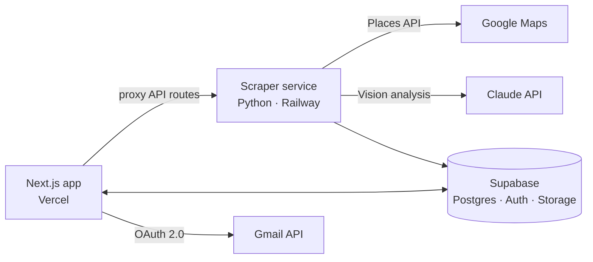

# Prospect Engine

A full-stack outreach platform I built to find, qualify and contact new clients for my video studio, [UnFocus](https://unfocus.com.au).

It replaces a manual process — searching Google Maps, checking each business's Instagram, writing emails one by one — with a single pipeline: find businesses, score how much they need better video content, and send a personalised email.

**Live:** [getprospectengine.com](https://getprospectengine.com)

---

## What it does

1. **Find** — searches Google Maps (Places API) by location and business type, then enriches each result from the business's own website (email, Instagram).
2. **Qualify** — I upload screenshots of a business's Instagram; Claude Vision scores the content and ranks the lead as High, Medium or Low opportunity.
3. **Write** — generates three email drafts per lead (technical, warm, follow-up) based on the analysis.
4. **Send & track** — sends through the Gmail API, logs every status change on a timeline, handles unsubscribes and schedules re-contact.

## Architecture



- **Frontend + API routes:** Next.js 15 (App Router), React 19, TypeScript
- **Database, auth, storage:** Supabase — Postgres with row-level security, screenshot storage bucket, realtime job status
- **Scraper & analysis service:** Python microservice (FastAPI) deployed separately on Railway, protected by a bearer token
- **AI:** Claude API for image analysis, lead scoring and email drafting
- **Email:** Gmail API with OAuth 2.0, signed unsubscribe tokens (HMAC)
- **Scheduled jobs:** Vercel Cron for screenshot cleanup and re-engagement

## Design decisions

- **Two services, not one.** Scraping and AI analysis are slow, long-running jobs. They run in a separate Python service with background jobs, so the Next.js app stays fast and within serverless time limits.
- **Human in the loop.** The system drafts emails but never sends on its own — every email is reviewed before it goes out.
- **Deduplication by Google `place_id`**, so repeated searches never create duplicate leads.
- **Stateless unsubscribe links** — an HMAC-signed token instead of an extra database table.

## Project structure

```
app/               Next.js pages and API routes
components/        React UI components
lib/               Supabase clients, Gmail, helpers
scraper-service/   Python service: scraping, enrichment, Claude Vision analysis
db/                Schema and migrations
docs/              Architecture notes and setup guides
```

## Running locally

```bash
cp .env.example .env.local   # fill in your own keys
npm install
npm run dev
```

The scraper service has its own `.env.example` and runs with `uvicorn main:app` from `scraper-service/`.

## How I built it

I designed the product, the data model and the architecture, and built it with AI-assisted development (Claude Code) as part of my workflow.

---

Built by [Francesco Bugugnoli](https://www.francescobugugnoli.com) · [LinkedIn](https://www.linkedin.com/in/francesco-bugugnoli-3325b656/)
